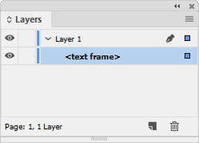
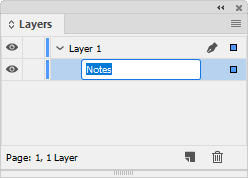
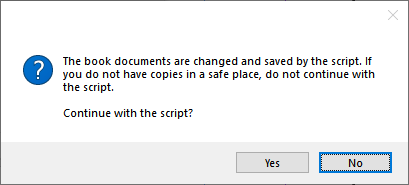

# End-of-book notes
Endnotes were introduced in InDesign in version CC2018. An endnote consists of two linked parts: the endnote reference number that appears in source text, and the endnote text that appears in a new frame at the end of the document. While InDesign doesn’t create endnotes at the end of a book, using this script you can convert end-of-document endnotes to end-of-book endnotes.
## Preparation
To set up your book for end-of-book endnotes, do the following:
1.	Create a new document where your end of document endnotes will be collected.
2.	Add a single text frame on the first document page, and name it “Notes” using the Layers panel:
* Choose **Window > Layers**.
* Click twice (not a double-click) on the <text frame> to edit the name.
* Enter “Notes”.

3.	Change endnote numbering and layout options:
* Choose Type > Document Endnote Options.
* Edit Endnote Header > Paragraph Style to choose a paragraph style ffor the section headings in the endnote document (“Notes to chapter 1”, etc.)
* *Optionally*, also edit the character style for the Endnote Reference Number in Text and the paragraph style for the Endnote Formatting (if not set, these styles will be inherited from the first document of your book that contains endnotes).
4.	Add this new document to the end of your book.
* Choose Add Document in the Book panel menu, click the plus button at the bottom of the Book panel, or drag and drop the new document onto the Book panel from an Explorer (Windows) or Finder (macOS) window
Next, copy the script to the Scripts Panel folder so that it shows up in the Scripts panel. To find the folder, open the Script panel (Window > Utilities > Scripts), right-click the User folder, and select Select in Explorer (Windows)/Select in Finder (Mac).
## Using the script
To run the script, do the following:
5.	Close any documents you currently have open.
6.	Open your InDesign book file.
7.	In the Book panel, double-click the end of book document you created earlier.
8.	Double-click the end of book endnotes script in the Scripts panel
WARNING: This script will change the contents of your individual book documents. It is therefore very important that you save your documents before you begin. There is no going back after converting end of document endnotes to end of book endnotes. The script will warn you before it starts to confirm this.

The script displays this alert before running.
When the script has finished running, all of the previous end of document endnotes will have been collected and moved into an end of book document. The script will automatically use the document file names for section headings.
## Example
To see how the script works, use the sample documents provided:
1.	Close any documents you currently have open.
2.	Open the **book-endnotes.indb** book file.
3.	In the Book panel, double-click the chapter-notes document.
4.	Double-click the end of book endnotes script in the Scripts panel.
The script first warns you that it will make changes to your documents, then checks whether there is just one book file and one document open, and whether the document contains the “Notes” text frame.

## Additional notes
* The script inherits any paragraph styles set in the *Document Endnote Options* dialog of the first document with endnotes.
* Endnote numbering is handled by InDesign’s automatic paragraph numbering.
* The endnote numbering mode (**Restart Every Story** or **Continuous**) is preserved in the endnote document. The separator set in the paragraph style is taken from the endnote options in the first document with endnotes
